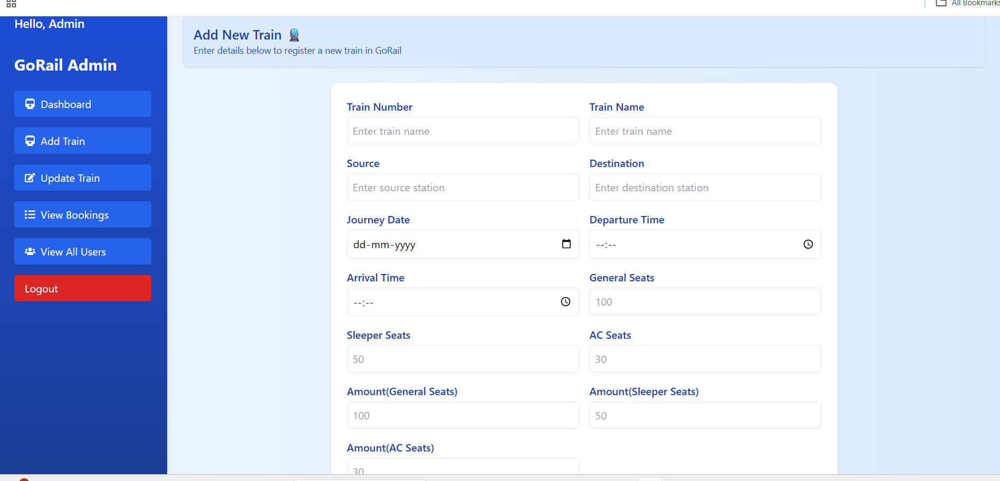
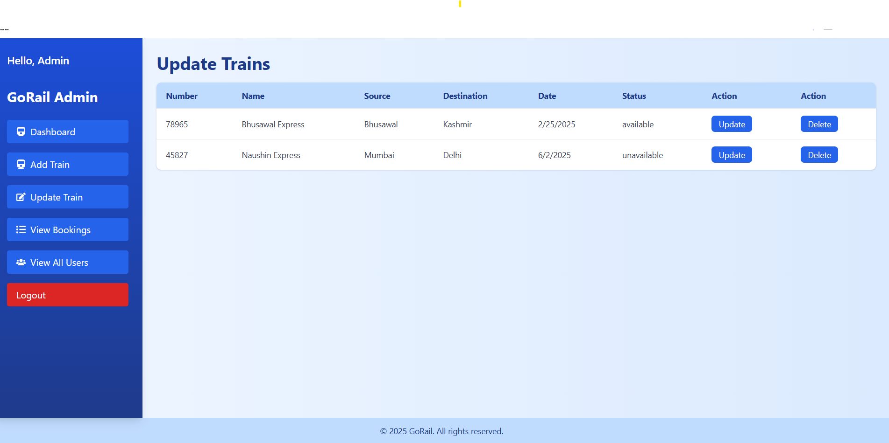
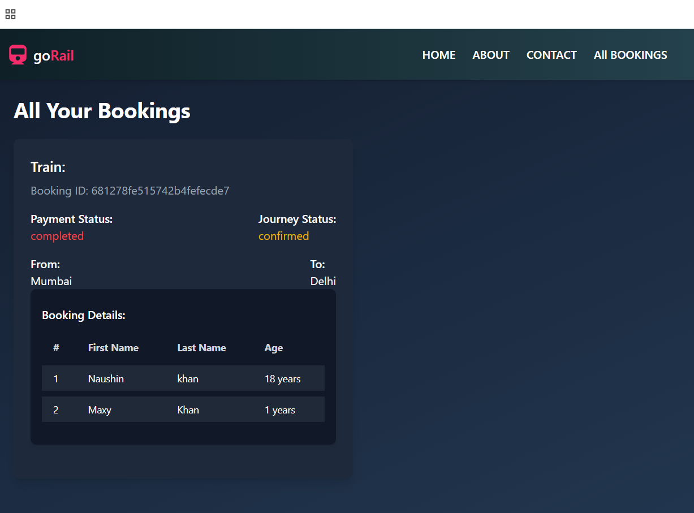
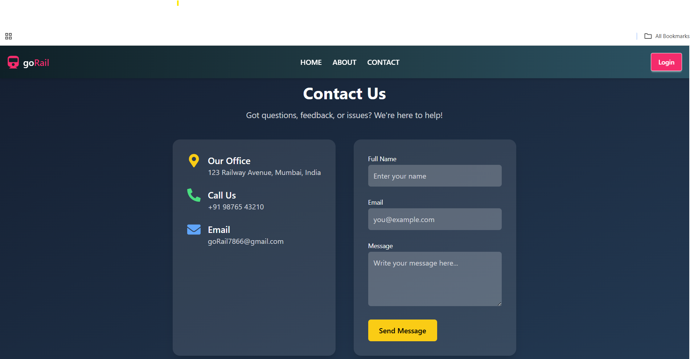

# 🚆 GoRail - Complete Railway Management App

🔗 **Live Demo**: [go-rail.vercel.app](https://go-rail.vercel.app)

---

## 📖 Overview

**GoRail** is a full-stack railway booking and management system with separate functionalities for **Admin** and **User**.  
It provides secure authentication, train booking, real-time payment (via Razorpay), email notifications, and complete admin control.

Built using **MERN Stack**, styled beautifully with **Tailwind CSS** and **DaisyUI**, and deployed using **Vercel**.

---

## 🌐 Application Structure

- **🔐 Admin Panel**
- **👤 User Interface**
- **📧 Mail System via Nodemailer**
- **💳 Razorpay Payment Integration (Test Mode)**

---

## 🛠️ Tech Stack

**Frontend**:
- React.js
- Tailwind CSS
- DaisyUI

**Backend**:
- Node.js
- Express.js
- MongoDB

**Other Tools**:
- JWT for Authentication
- Nodemailer for Emailing
- Razorpay for Payment

---

## 🧑‍💻 Admin Side

### 🔑 Admin Login (JWT Authenticated)
- Admin logs in with unique credentials.
- Secured using **JWT tokens**.

### 🖥️ Admin Dashboard


#### 👥 All Users
- View all registered users
- Delete any user


#### 📄 All Bookings
- View all passenger bookings
- Update journey status (Confirm or Cancel)


#### ➕ Add Train
- Add new train details


#### ✏️ Update Train
- Update train details


---

## 👤 User Side

### 🏠 Landing Page (Before Login)
- Search train by source and destination
- No login required to search


### 📝 Sign Up / Login (JWT Authentication)
- New users can register
- Secure login with token-based auth

### 🧾 Booking Train
- Provide passenger details and seat type
- Booking gets stored in database


### 💳 Razorpay Payment Integration
- After booking, user sees pending payment
- Click "Pay" to open Razorpay test window
- On payment, status is updated

### 📧 Email Notifications via Nodemailer
- On booking: confirmation email
- On admin approval: "Ticket Confirmed" email

---

## 📬 Contact Admin

- "Contact Us" form
- User can send queries to admin via email
- Powered by **Nodemailer**


---

## 📦 How to Run Locally

### Backend

```bash
git clone https://github.com/yourusername/gorail.git
cd backend
npm install
npm run dev

```
## Deploy
- Frontend deployed on: **Vercel**
- Backend deployed on: **Railway**

## Connect with Me
- **linkedIn**:[LinkedIn](www.linkedin.com/in/naushink27)
- **Github**:[github](www.github.com/Naushink27)
  
